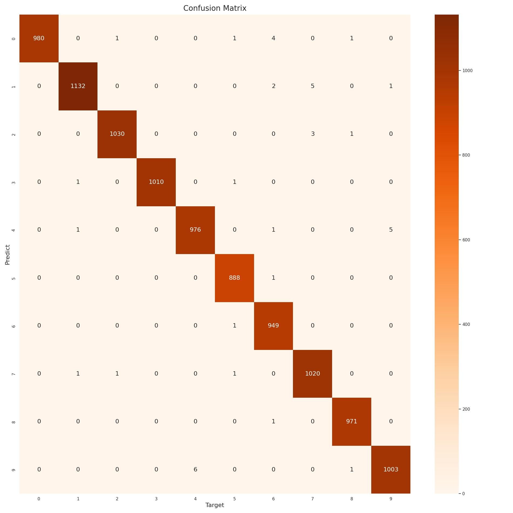

# MNIST Classification

This project fine-tune torchvision pretrained weights to classify MNIST images and try to run Pytorch model with Rust

## Environments

- Python 3.8.10
- torch 2.0.1
- torchvision 0.15.2

Install requirements

``` bash
pip install -U pip
pip install -r requirements.txt
```

## Data

You can download MNIST dataset from [here](https://drive.google.com/file/d/1JimUxm4tpbsg2zOqbGnbJDzJHwgp6by7/view?usp=share_link), use torch dataset or simply run this script

``` bash
bash scripts/download_data.sh
```

## Config

Modify config in `./configs/config.py`

## Train

Simply run 

``` bash
python tools/pytorch/train.py
```

## Experiment Results

Some experiment results

| Model | Accuracy | Confusion Matrix | Pretrained | Model size |
| --- | :---: | :---: | :---: | :---: |
| **Resnet18** | 99.64% |  | [Model](https://bit.ly/3E5HxM5) | 44.71MB |

You can download weight file above

## Infer

You can infer with

``` bash
python tools/pytorch/infer.py
```

## Inference on other format

### Rust

Refer [here](./rust/README.md)

## Some inference results

You can try on your own :wink:

## Reference

- [tch-rs](https://github.com/LaurentMazare/tch-rs)